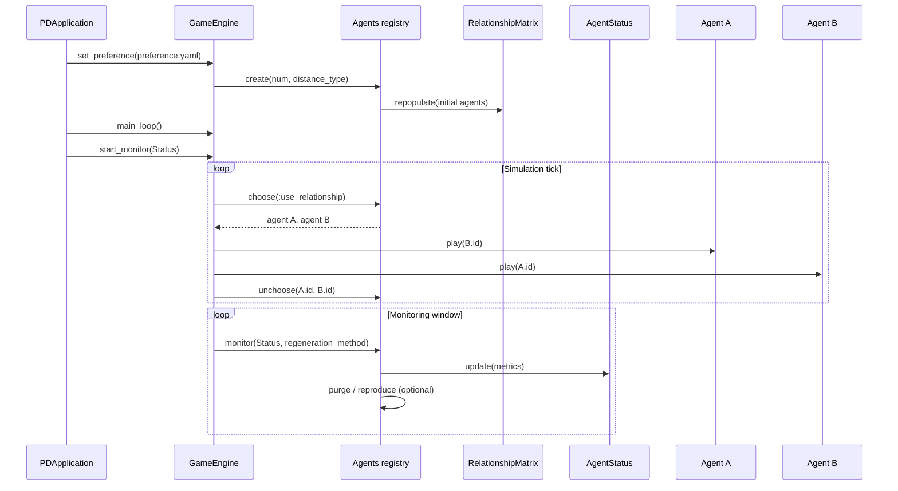

# RbPrisonersDilemma Overview

This document explains how the original Ruby codebase simulates an iterated Prisoner's Dilemma with emotionally driven agents. It summarizes the runtime architecture, data structures, and the life cycle of agents so you can quickly regain context on how the system works.

## Runtime Architecture

At startup `PDApplication.start` (defined in `main.rb`) loads simulation preferences, initializes the engine, and spins up two long-lived threads: the simulation loop and a monitoring loop. The overall control flow is illustrated below.



* `preference.yaml` currently requests 50 agents, the `:topology` relationship layout, and the `:fixed` regeneration policy.
* The main Ruby process sleeps for 50 seconds before shutting the threads down with `PDApplication.stop`, so a typical run is a one-minute snapshot of agent evolution.

## Core Components

### PDApplication (`main.rb`)
* Boots the simulation, printing the historical banner.
* Reads the YAML preference file and forwards it to the game engine.
* Manages thread lifecycles via a `ThreadGroup`, ensuring both simulation and monitor threads stop cleanly.

### GameEngine (`game_engine.rb`)
* Stores the loaded preferences (`@@pref`).
* Starts the main simulation thread that continuously:
  1. Requests two unlocked agents from `Agents.choose`.
  2. Asks each agent to `play` the Prisoner's Dilemma against the other.
  3. Converts their chosen strategies (floats 0.0–1.0) into payoff points by proportionally splitting the higher strategy value.
  4. Notifies each agent of the resulting points and the opponent's behavior via `knotify_result`.
  5. Frees the agents for reuse via `Agents.unchoose`.
* Starts a monitoring thread that periodically collects statistics and applies the configured regeneration rule.

### Agents Registry (`agents.rb`)
The `Agents` class is effectively a singleton namespace that owns every agent instance plus several global structures.

* **Agent roster** – `@@agent_list` holds all `Agents` instances. Each agent has mutable attributes such as happiness, strategy vector, and "default opponent" expectations.
* **Relationship matrix** – `@@relationship_matrix` stores, for every ordered pair of agents, the perceived distance, familiarity, and observed strategy (see the next section).
* **Locking** – To prevent race conditions between threads, `@@lock_list` (with `MonitorMixin`) guards agent selection. `Agents.choose` waits if the monitor thread is preparing statistics, locks the chosen agents' IDs, and returns them. `Agents.unchoose` releases those IDs and increments a global interaction counter (`@@total_count`).
* **Creation and reproduction** – `Agents.reproduce` clones the most recent agents, mutating parameters slightly with the `regenerate` helper to simulate heredity. `@@sup_id` tracks the next free ID, and the relationship matrix is expanded with `RelationshipMatrix#repopulate` to include the newcomers.
* **Purging** – Depending on the regeneration strategy, low-happiness agents can be removed via `Agents.purge`, which also trims the relationship matrix and updates the ID-to-offset index.
* **Monitoring** – `Agents.monitor` spawns a thread that sleeps for five seconds, locks the registry, sorts agents by happiness, and passes a summarized view to `AgentStatus`. It also applies regeneration callbacks (e.g., the `:fixed` method removes agents below a happiness threshold and duplicates those above).

### Individual Agent Behavior (`agents.rb`)
Each agent models memory, emotion, and social influence.

```mermaid
flowchart TD
    A[Agent.play(opponent_id)] --> B{Known strategy?}
    B -- yes --> C[Use cached opponent strategy]
    B -- no --> D{Ask friends?}
    D -- yes --> E[Weighted advice]
    D -- no --> F[Default expectation]
    C --> G[Mix with default & weight]
    E --> G
    F --> G
    G --> H[think(anticipation)]
    H --> I[Return chosen strategy]
```

* **Perception** – Agents first check the relationship matrix for a cached strategy of their opponent. If unknown, they may query socially closest neighbors via `ask_others`, limited by `@@hum_net` (logarithmic in population size).
* **Decision making** – The final anticipation value is a weighted blend of the perceived opponent strategy and the agent's default expectation. The `think` method picks a strategy bucket from the agent's internal array (`@strategy`), sized by `@div` (2–4 entries).
* **Learning** – When `knotify_result` is called, the agent updates:
  * A rolling average of the opponent's observed strategy in the relationship matrix.
  * Personal happiness (exponential moving average controlled by `@@current_point_weight`).
  * Trust toward any helper who advised them, halving the social distance if the round went well.
  * The default expectation of opponents, blending emotional response and recent observations.

### RelationshipMatrix (`relationship_matrix.rb`)
The matrix tracks pairwise metadata between agents. Each cell is a five-element array: `[id_i, id_j, distance, familiarity, opponent_strategy]`.

* **Initialization** – `populate` builds an `n x n` matrix based on the requested distance model (`:rand`, `:sym_rand`, `:topology`, or `:uniform`). Distances seed both the structural kinship (`@@doff`) and familiarity (`@@famoff`).
* **Kinship views** – `update_kinship` maintains sorted views by distance and familiarity, enabling fast friend lookups.
* **Repopulation** – When new agents appear, `repopulate` clones rows/columns from parents and blends in random noise through `regenerate`. The heredity argument links child IDs to their parent's offset so the topology remains coherent.
* **Removal** – `remove` drops purged agents, rebuilds the matrix, and updates the shared ID-to-offset lookup used throughout the system.

### AgentStatus Reporter (`agent_status.rb`)
* Holds ERB templates that render plain-text reports (`text_template_stat.txt` and `text_template_happiness.txt`).
* On every monitor tick, aggregates averages for strategy, happiness, weight, etc., plus a histogram of happiness buckets and genotype counts.
* Running `AgentStatus#update` writes the formatted text to STDOUT (the ERB templates call `print`), giving you periodic visibility into population health.

## Configuration and Tuning Points

| Preference | Purpose | Relevant Code |
|------------|---------|---------------|
| `:num` | Initial number of agents cloned from random seeds. | `Agents.create` &rarr; `Agents.reproduce` |
| `:distance_type` | Spatial layout influencing friend networks and trust decay. | `RelationshipMatrix#populate` |
| `:regeneration_method` | Strategy for purging unhappy agents and duplicating successful ones. | `Agents.monitor` & regeneration lambdas |

Other notable constants live inside `Agents` (e.g., `@@low_threshold`, `@@upp_threshold`, `@@current_point_weight`) and govern emotional inertia, happiness cutoffs, and social bandwidth.

## Putting It All Together

The system maintains a continuously interacting society:

1. **Matchmaking** chooses two free agents, biased by social proximity when `:use_relationship` is enabled.
2. **Interaction** lets each agent synthesize advice, memory, and instinct into a cooperation probability and resolves the payoff.
3. **Learning** records opponent tendencies, updates emotional state, and subtly shifts default expectations.
4. **Monitoring** periodically snapshots the population, pruning the least happy agents and cloning the most successful according to the chosen regeneration rule.

With this mental model, you can adjust parameters or extend behaviors (e.g., new distance metrics or richer emotional responses) while respecting the original design.
